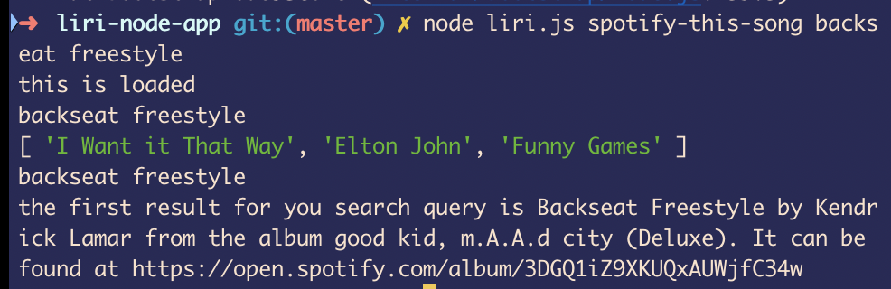
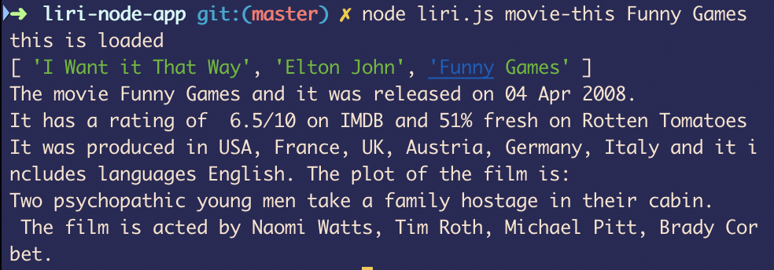
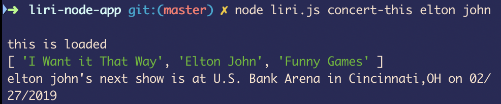
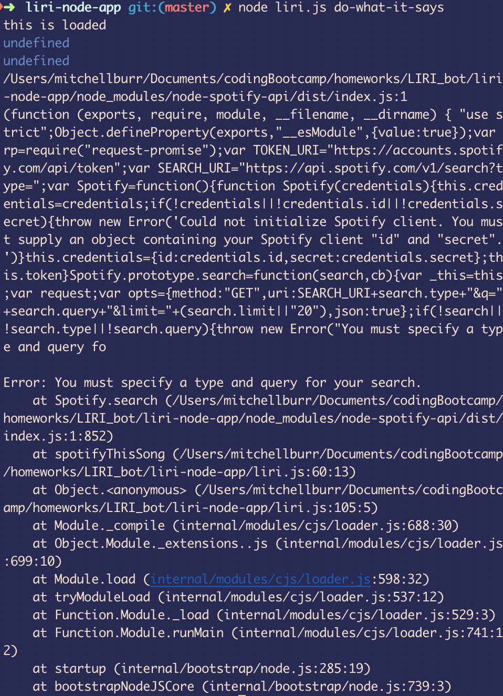

# liri-node-app

Language

Interpretation

Recognition

Interface
Bot  

=========================================================================================
large demonstration photo showing random.txt

=========================================================================================
spotify-this example

=========================================================================================
movie-this example

=========================================================================================
concert-this example

=========================================================================================

In the other examples you can see the variableArray defined from the random.txt file. For some reason I can't pass the elements of the array to the spotify function. They are undefined even before I put them in the function (the first console.log is in the if statement at the bottom). Must be something to do with the read function adding things to the array in a weird format :| .
